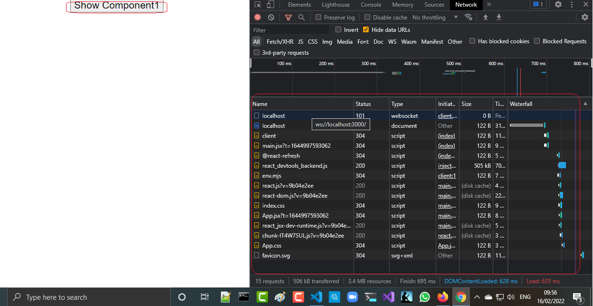

<h2>Motivation</h2>
Experiment with react code splitting : React.lazy \ React.Suspense

<h2>Points of interest</h2>
Component1 is not loading when the App is loading 

<h2>Setup</h2>
<ul>
<li>npm i</li>
<li>npm run dev</li>
</ul>